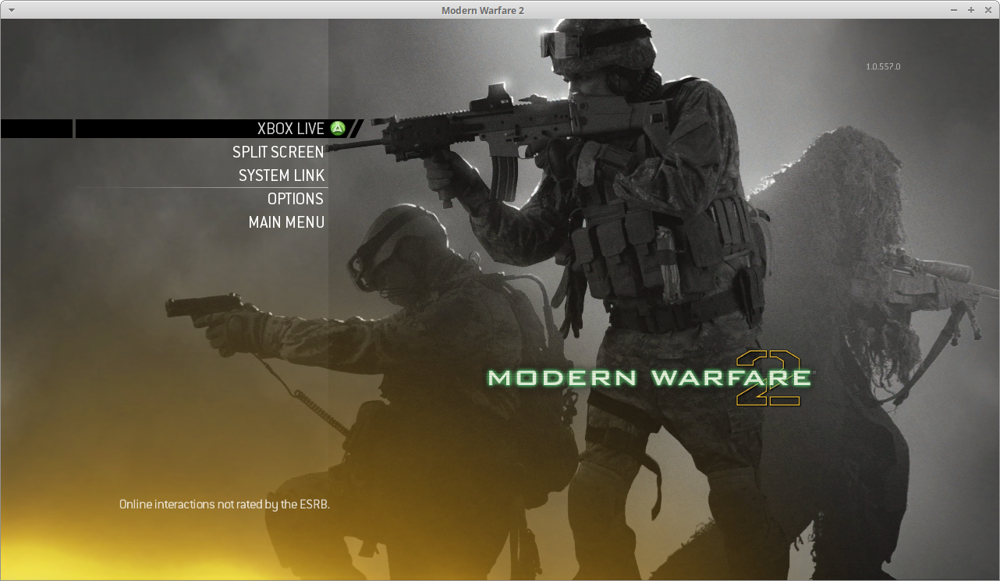

# Modern Warfare 2, recompiled

Call of Duty: Modern Warfare 2 (2009) for the Xbox 360, running natively on PC.
Not an emulator: the game's executables are recompiled ahead of time. No game
files are included; you need your own disc.

**[Download the latest release](../../releases/latest)**

## Features

- Campaign and multiplayer
- Private matches and system link, online with friends:
  - **Steam** build: invite friends through Steam, no port to open
  - **LAN** build: for players without Steam, on the same network
- 60 fps, native MSAA, any window size or fullscreen
- Xbox 360-style controller, with rumble

Not supported: public matchmaking and ranked playlists (they needed
Activision's servers), cutscene and loading movies. Special Ops is untested.

## Requirements

- An ISO of the Xbox 360 disc, version 1.0.557 (as on the main menu; title
  updates can't be used). The installer checks it.
- Linux or Windows, 64-bit; or Android 8.0 and later on a 64-bit phone
  ([docs/android.md](docs/android.md))
- A Vulkan 1.2 GPU (1.1 on Android)
- 6 GB of disk space
- A controller (the keyboard only covers the menus; Android has an
  on-screen pad you can rearrange)

## Install

1. Download `steam` or `lan` for your system from the
   [releases](../../releases/latest), and extract it anywhere.
2. Start `mw2-sp` (campaign) or `mw2-mp` (multiplayer). The first time, it
   asks for your ISO and copies the game files into `game/` beside it.

From a terminal: `./mw2-mp --install path/to/game.iso` (an extracted disc
folder works too).

Saves go in `saves/` beside the executables.

## Android

`android/` is a full port: the same runtime, a Vulkan surface from the
activity, AAudio, and an on-screen pad every part of which can be moved,
resized, hidden or made to stay down when tapped. Physical controllers work
and can be switched off entirely. An imported Turnip driver can be used in
place of the phone's own.

Building it means building the desktop project first (the recompiler runs
there) and then Gradle: see [docs/android.md](docs/android.md).

## Play

| key | |
|---|---|
| `F8` | fullscreen |
| `F6` | invite friends (Steam) |
| arrows, `Enter`, `Esc` | d-pad, Start, Back |
| `Z` `X` `C` `V`, `Q` `E` | A B X Y, bumpers |

**Online.** Everyone runs `mw2-mp` from the same build.

- **Steam**: Steam must be running; the game shows as *Spacewar*. Host a
  PLAY ONLINE → PRIVATE MATCH, invite from Steam's friend list (or `F6` if you
  added `mw2-mp` to Steam as a non-Steam game). The friend accepts while their
  game is running.
- **LAN**: SYSTEM LINK finds games on the network by itself. For private
  matches, the lobby's "Invite friends" invites everyone on the network; start
  the others with `MW2_LAN_ACCEPT=1`. Your name is your login, or `MW2_NAME=`.

**Settings** (environment variables): `MW2_FULLSCREEN=1`, `MW2_MSAA=<n>` or
`MW2_NO_MSAA=1`, `MW2_NO_AUDIO=1`.

**Bug reports**: run with `MW2_LOG_FILE=mw2.log` and attach the file.

## Developers

Building, the source layout and how the runtime works:
[docs/building.md](docs/building.md), [docs/runtime.md](docs/runtime.md),
[docs/switches.md](docs/switches.md), [docs/android.md](docs/android.md),
and the rest of [docs/](docs/).

## License

[GPL-3.0-only](LICENSE) (`SPDX-License-Identifier: GPL-3.0-only`). It covers this
project's own code: the runtime, tools, patches and build files. It grants
nothing for the game: Activision's code and data, and the C++ generated from
the game's executables, are not part of this repository and not under this
license.

No game code or data is included; the builds only run with files from your
own disc. Not affiliated with Activision, Infinity Ward or Microsoft.
